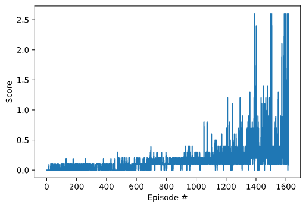

# Collaboration and Competition - Tennis

Author: Ashvitha R Shetty

### Project details

two agents control rackets to bounce a ball over a net. If an agent hits the ball over the net, it receives a reward of +0.1.  If an agent lets a ball hit the ground or hits the ball out of bounds, it receives a reward of -0.01.  Thus, the goal of each agent is to keep the ball in play.

The observation space consists of 8 variables corresponding to the position and velocity of the ball and racket. Each agent receives its own, local observation.  Two continuous actions are available, corresponding to movement toward (or away from) the net, and jumping. 

The task is episodic, and in order to solve the environment, your agents must get an average score of +0.5 (over 100 consecutive episodes, after taking the maximum over both agents). Specifically,

- After each episode, we add up the rewards that each agent received (without discounting), to get a score for each agent. This yields 2 (potentially different) scores. We then take the maximum of these 2 scores.
- This yields a single **score** for each episode.

The environment is considered solved, when the average (over 100 episodes) of those **scores** is at least +0.5.

The environment is based on [Unity ML-agents](https://github.com/Unity-Technologies/ml-agents). The Unity Machine Learning Agents Toolkit (ML-Agents) is an open-source Unity plugin that enables games and simulations to serve as environments for training intelligent agents.


### Algorithm

I have implemented Multi Agent DDPG (Deep Deterministic Policy Gradient) with 2 agents. DDPG is a model-free off-policy algorithm for learning continous actions. It combines ideas from DPG (Deterministic Policy Gradient) and DQN (Deep Q-Network). It uses Experience Replay and slow-learning target networks from DQN, and it is based on DPG, which can operate over continuous action spaces.

Sources:
- [Deep Deterministic Policy Gradient](https://keras.io/examples/rl/ddpg_pendulum/)


### Network Architecture

- For each agent:
    - There are a total of four networks: local and target actor networks, and local and target critic networks.
    - The actor's networks consists of 2 fully connected layers. The critic's networks consist of 2 fully connected layers.
    - For actors, there are 48 states (24 per agent), 256, 128 and 2 (actions) neurons in each layer respectively.
    - For critics, there are 52 (48 states + 4 actions), 256, 128 and 1 (Q value) neurons in each layer respectively.
    - The actor network takes the state as input and gives an action as output.
    - The critic network takes the combination of state and action of both the agents as input and gives the Q value as output.
    - The network is updated in every timestep.

### Hyperparameters

```
BUFFER_SIZE = int(1e6)  # replay buffer size
BATCH_SIZE = 128        # minibatch size
GAMMA = 0.99            # discount factor
TAU = 0.07              # for soft update of target parameters
LR_ACTOR = 1e-3         # learning rate of the actor
LR_CRITIC = 1e-3        # learning rate of the critic
```

### Results

The environment was solved in 1617 episodes with an average reward of 0.5 over 100 consecutive episodes. The graph below shows the reward received in each episode.



### Future Ideas

- Explore algorithms such as PPO and TRPO to train the agent and compare the results.
- Use prioritized replay buffer to give importance to rare events during random sampling of events.
